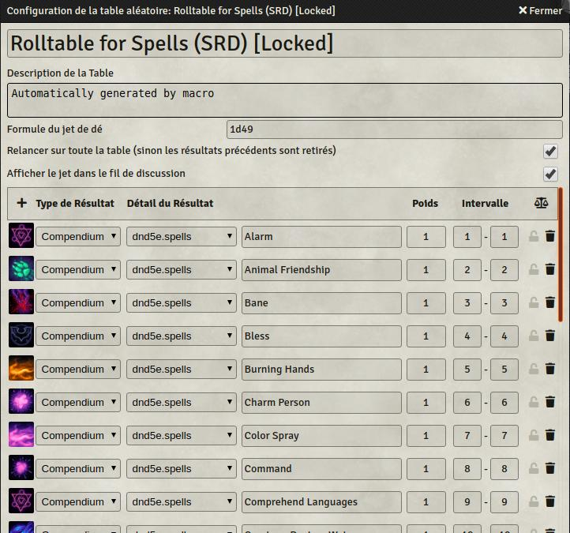
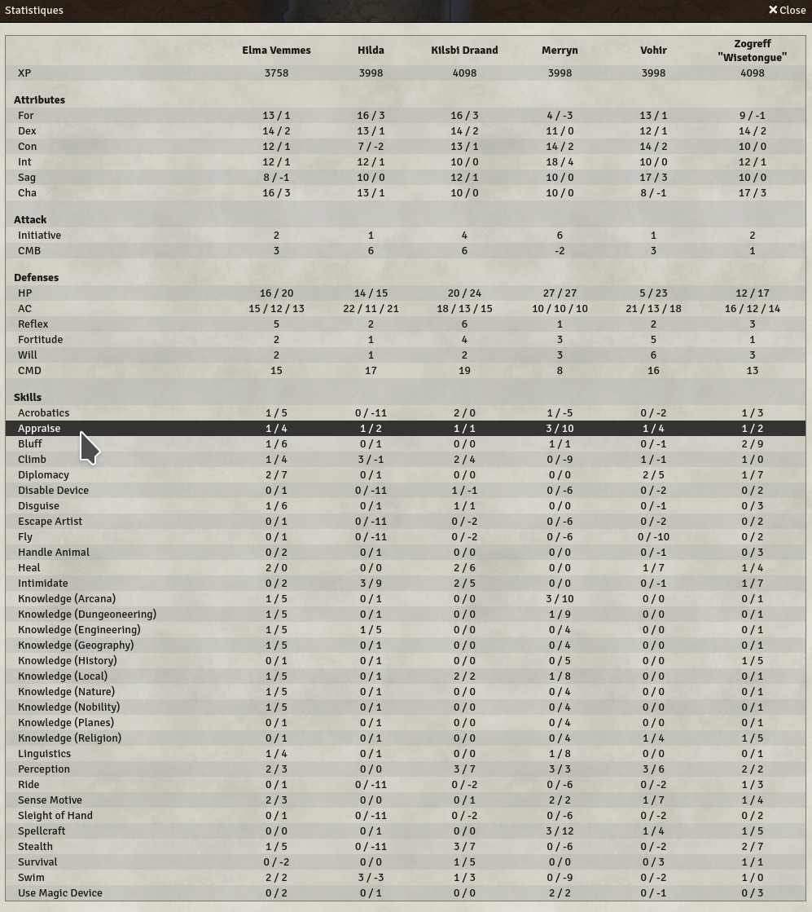

# Foundry VTT macros

A few macros for [Foundry VTT](https://foundryvtt.com/)

* [Update embedded entitites of an actor from Compendium(s)](#update-embedded-entitites-of-an-actor-from-compendiums)
* [Generate a roll table from a Compendium](#generate-a-roll-table-from-a-compendium)
* [Overview of all PCs (PF1)](#overview-of-all-pcs)

## Update embedded entitites of an actor from Compendium(s)

**Use case**: you created an actor and added elements from compendiums (ex: class, weapons, items). The compendiums have been updated and the data in the actor must now be updated. The script automates the update of each embedded entitity by looking for its name in the available compendiums. 

**How to use**
* Select a token on the map (which is linked to an actor)
* Execute the macro
* Confirm

Script: [update_embedded_entities.js](macros/update_embedded_entities.js)


## Generate a roll table from a Compendium

**Use case**: you want to randomly pick an element from a compendium. For example, as GM you want to randomly a spell of level 1 as potion for a loot

**How to use**
* Configure the script
  * **collection**: must match the identifier of the compendium. *Tip: if you manually create a roll table and choose "from compendium", you'll see the identifiers of each compendium*
  * **filter**: must correspond to the data structure of the compendium. See examples below

**Examples**
* All spells from D&D:
```
const CONFIG = {
  collection: "dnd5e.spells", 
  filters: {},
}
```
* All spells (lvl 1) from PF2:
```
const CONFIG = {
  collection: "pf2e.spells-srd", 
  filters: { "data.data.type": "armor" },
}
```
* All weapons (damage type P) from PF1:
```
const CONFIG = {
  collection: "pf2e.spells-srd", 
  filters: { "data.data.weaponData.damageType": "P" },
}
```



Script: [generate_rolltable.js](macros/generate_rolltable.js)


## Overview of all PCs

**Use case**: as GM, you often need to know some stats from the PCs. Navigating through the sheets can take time and slow the game.

**How to use**
* Simply execute the macro (only works with system PF1!)



Script: [pcs_overview.js](macros/pcs_overview.js)
